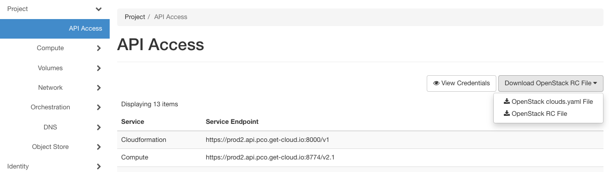

# pluscloud open: Terraform examples

These are [Terraform](https://www.terraform.io/) examples to use with [OpenStack](https://www.openstack.org) on the [pluscloud open](https://www.plusserver.com/en/products/pluscloud-open) - the data sovereign open source cloud offered by [plusserver](https://www.plusserver.com/en/). They should run on any OpenStack with small adjustments.

Take a look at the image names and instance flavors. They should be available on any SCS compliant CSP, but everywhere else they will likely differ.

They don't claim to be perfect, but they are intended to serve as a good starting point. And you're welcome to provide feedback by opening an issue here on github.

# Before you start

Download your credentials (clouds.yaml) via Horizon and add your password as secure.yaml in your working directory (or in your $HOME/.config/openstack).

You can find documentation on using clouds.yaml on [docs.openstack.org](https://docs.openstack.org/python-openstackclient/zed/configuration/index.html).

Example for a project on prod1.

```
clouds:
  openstack:
    auth:
      auth_url: https://prod1.api.pco.get-cloud.io:5000
      username: "admin"
      project_id: 980c0d0dcb874244a54a6c149fa6d389
      project_name: "p123456-my-project"
      user_domain_name: "d123456"
    region_name: "prod1"
    interface: "public"
    identity_api_version: 3
```

It can be downloaded in the Horizon UI under Project / API Access



or via this [link](https://prod1.api.pco.get-cloud.io/project/api_access/clouds.yaml/) on prod1 for example.

The default "cloud" name is openstack. You can rename it - matching project or CSP and add multiple entries.

To use it with the openstack provider for Terraform you can define it in your Terraform file like your main.tf:

```
provider "openstack" {
  cloud  = "pluscloudopen" # cloud defined in cloud.yml file
}
```

or via environment variable OS_CLOUD.

```
$ export OS_CLOUD="openstack"
```

just as you like.

# Our examples

Here is a list of our examples:

* just-one-instance - will spawn a single instance in your project without any extras
* instance-using-cloud-init - will spawn an instance with cloud-init deploying a nginx plus security group needed

# For further reading

You can find additional documentation here:

* [Terraform Documentation](https://developer.hashicorp.com/terraform/docs)
* [Terraform OpenStack Provider](https://registry.terraform.io/providers/terraform-provider-openstack/openstack/latest/docs)
